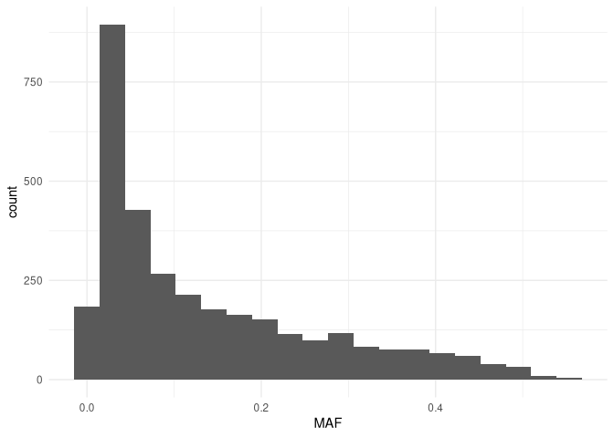
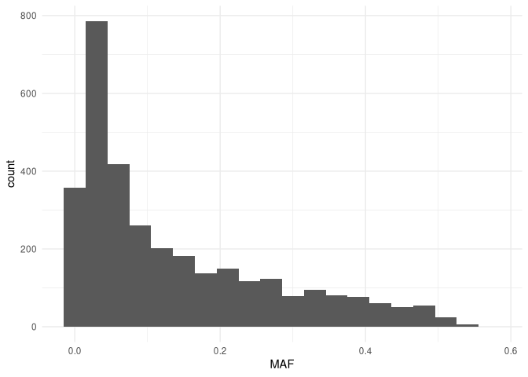
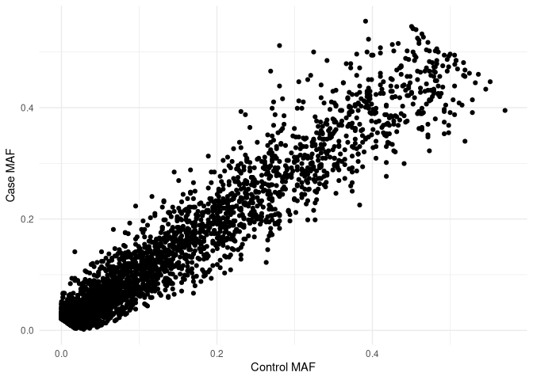
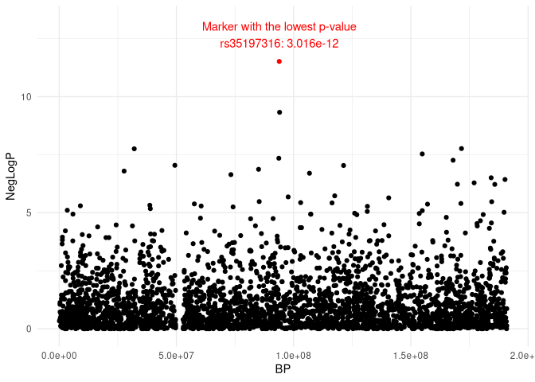

## 11. Then, create an RMarkdown file that knits to an HTML file which

Ah look, here we are! …gonna install/load dependencies here.

## 12. Reads the two allele frequency files and the logistic regression output into R, and

    lr <- read.table(
      "data/data.assoc.logistic",
      header = TRUE
    )
    ctrls <- read.table(
      "data/data4.ctrls.freq",
      header = TRUE
    )
    cases <- read.table(
      "data/data4.cases.freq",
      header = TRUE
    )

## 13. Plots a histogram of the case allele frequencies,

    cases %>% 
      ggplot() +
      aes(x = MAF) +
      geom_histogram(bins = 20) +
      theme_minimal()

## 14. Plots a histogram of the control allele frequencies,

    ctrls %>% 
      ggplot() +
      aes(x = MAF) +
      geom_histogram(bins = 20) +
      theme_minimal()

## 15. Plots a scatterplot of the case individuals’ allele frequencies (y axis) –AND– 16. Versus the control individuals’ allele frequencies (x axis),

    # merge the cases and controls on the SNP
    case_controls <- cases %>% 
      select(SNP, MAF) %>% 
      rename(`Case MAF` = MAF) %>%
      inner_join(
        ctrls %>%
          select(SNP, MAF) %>%
          rename(`Control MAF` = MAF),
        by = "SNP"
      )
    # create the scatterplot
    case_controls %>% 
      ggplot() +
      aes(x = `Control MAF`, y = `Case MAF`) +
      geom_point() +
      theme_minimal()

## 17. Plots a scatterplot of −log₁₀(p values) (y axis) versus chr4 basepair position (x axis), –AND– 18. Reports the marker and p value of the marker with the lowest p value; then

    lr$NegLogP <- -log10(lr$P)
    lr_cleaned <- lr %>% 
      drop_na() %>% 
      filter(CHR == 4) %>% 
      mutate(color = factor(if_else(P == min(P), "Min", "Other")))
    lowest_p <- lr_cleaned %>% 
      filter(color == "Min")
    lr_cleaned %>% 
      ggplot() +
      aes(
        y = NegLogP,
        x = BP,
        color = color
      ) +
      geom_point() +
      # source referenced for annotating the min point:
      # https://stackoverflow.com/questions/14351608/color-one-point-and-add-an-annotation-in-ggplot2
      scale_color_manual(
        values = c("Min" = "red", "Other" = "black")
      ) +
      geom_text(
        aes(
          y = NegLogP * 1.1,
          x = BP,
          label = paste0(
            "Marker with the lowest p-value\n",
            SNP,
            ": ",
            P
          )
        ),
        data = lowest_p
      ) + 
      # stretch the ylim a bit to fit the text annotation
      ylim(-0.1, max(lr_cleaned$NegLogP) * 1.15) +
      theme_minimal() +
      theme(legend.position="none")

## 19. Loads the snp\_annot.RData workspace and merges the p values into the SNP annotation data frame object snp\_annot\_df in such a way that –AND– 20. The order of the SNPs in snp\_annot\_df is unchanged.

    load("/ix1/hugen2072-2026s/ca/snp_annot.RData")
    to_merge <- lr %>% 
      select(SNP, P) %>% 
      rename(rsID = SNP)
    temp_snp_annot_df <- snp_annot_df %>% 
      # had to reference the docs
      # https://www.bioconductor.org/packages//2.13/bioc/vignettes/GWASTools/inst/doc/DataCleaning.pdf
      pData() %>% 
      left_join(
        to_merge,
        by = "rsID"
      )
    new_snp_annot_df <- snp_annot_df
    new_snp_annot_df$P <- temp_snp_annot_df$P
    # double check the dimensions of the new df vs the old
    # expecting the same number of rows and one extra column
    print(
      paste0(
        "Original number of columns: ",
        ncol(snp_annot_df)
      )
    )

    ## [1] "Original number of columns: 6"

    print(
      paste0(
        "New number of columns: ",
        ncol(new_snp_annot_df)
      )
    )

    ## [1] "New number of columns: 7"

    print(
      paste0(
        "Original number of rows: ",
        nrow(snp_annot_df)
      )
    )

    ## [1] "Original number of rows: 6516"

    print(
      paste0(
        "New number of rows: ",
        nrow(snp_annot_df)
      )
    )

    ## [1] "New number of rows: 6516"

    # show the new table 
    kable(head(pData(new_snp_annot_df)))

<table>
<thead>
<tr>
<th style="text-align: right;">snpID</th>
<th style="text-align: right;">chromosome</th>
<th style="text-align: right;">position</th>
<th style="text-align: left;">rsID</th>
<th style="text-align: left;">alleleA</th>
<th style="text-align: left;">alleleB</th>
<th style="text-align: right;">P</th>
</tr>
</thead>
<tbody>
<tr>
<td style="text-align: right;">1</td>
<td style="text-align: right;">3</td>
<td style="text-align: right;">88741</td>
<td style="text-align: left;">rs9857182</td>
<td style="text-align: left;">G</td>
<td style="text-align: left;">T</td>
<td style="text-align: right;">0.04825</td>
</tr>
<tr>
<td style="text-align: right;">2</td>
<td style="text-align: right;">3</td>
<td style="text-align: right;">128188</td>
<td style="text-align: left;">rs34609379</td>
<td style="text-align: left;">C</td>
<td style="text-align: left;">A</td>
<td style="text-align: right;">0.82380</td>
</tr>
<tr>
<td style="text-align: right;">3</td>
<td style="text-align: right;">3</td>
<td style="text-align: right;">239120</td>
<td style="text-align: left;">rs4684304</td>
<td style="text-align: left;">G</td>
<td style="text-align: left;">A</td>
<td style="text-align: right;">0.38940</td>
</tr>
<tr>
<td style="text-align: right;">4</td>
<td style="text-align: right;">3</td>
<td style="text-align: right;">279318</td>
<td style="text-align: left;">rs73090643</td>
<td style="text-align: left;">C</td>
<td style="text-align: left;">T</td>
<td style="text-align: right;">NA</td>
</tr>
<tr>
<td style="text-align: right;">5</td>
<td style="text-align: right;">3</td>
<td style="text-align: right;">338224</td>
<td style="text-align: left;">rs331889</td>
<td style="text-align: left;">T</td>
<td style="text-align: left;">C</td>
<td style="text-align: right;">0.01793</td>
</tr>
<tr>
<td style="text-align: right;">6</td>
<td style="text-align: right;">3</td>
<td style="text-align: right;">341836</td>
<td style="text-align: left;">rs17021929</td>
<td style="text-align: left;">G</td>
<td style="text-align: left;">A</td>
<td style="text-align: right;">0.63550</td>
</tr>
</tbody>
</table>

    kable(tail(pData(new_snp_annot_df)))

<table style="width:100%;">
<colgroup>
<col style="width: 7%" />
<col style="width: 8%" />
<col style="width: 16%" />
<col style="width: 14%" />
<col style="width: 17%" />
<col style="width: 11%" />
<col style="width: 11%" />
<col style="width: 10%" />
</colgroup>
<thead>
<tr>
<th style="text-align: left;"></th>
<th style="text-align: right;">snpID</th>
<th style="text-align: right;">chromosome</th>
<th style="text-align: right;">position</th>
<th style="text-align: left;">rsID</th>
<th style="text-align: left;">alleleA</th>
<th style="text-align: left;">alleleB</th>
<th style="text-align: right;">P</th>
</tr>
</thead>
<tbody>
<tr>
<td style="text-align: left;">6511</td>
<td style="text-align: right;">6511</td>
<td style="text-align: right;">4</td>
<td style="text-align: right;">190729236</td>
<td style="text-align: left;">rs535837510</td>
<td style="text-align: left;">TAC</td>
<td style="text-align: left;">GAC</td>
<td style="text-align: right;">0.4848</td>
</tr>
<tr>
<td style="text-align: left;">6512</td>
<td style="text-align: right;">6512</td>
<td style="text-align: right;">4</td>
<td style="text-align: right;">190752516</td>
<td style="text-align: left;">rs36038916</td>
<td style="text-align: left;">G</td>
<td style="text-align: left;">GC</td>
<td style="text-align: right;">0.8589</td>
</tr>
<tr>
<td style="text-align: left;">6513</td>
<td style="text-align: right;">6513</td>
<td style="text-align: right;">4</td>
<td style="text-align: right;">190756200</td>
<td style="text-align: left;">rs1344084</td>
<td style="text-align: left;">G</td>
<td style="text-align: left;">C</td>
<td style="text-align: right;">0.7329</td>
</tr>
<tr>
<td style="text-align: left;">6514</td>
<td style="text-align: right;">6514</td>
<td style="text-align: right;">4</td>
<td style="text-align: right;">190825958</td>
<td style="text-align: left;">rs4043018</td>
<td style="text-align: left;">C</td>
<td style="text-align: left;">T</td>
<td style="text-align: right;">1.0000</td>
</tr>
<tr>
<td style="text-align: left;">6515</td>
<td style="text-align: right;">6515</td>
<td style="text-align: right;">4</td>
<td style="text-align: right;">190904030</td>
<td style="text-align: left;">rs4613613</td>
<td style="text-align: left;">C</td>
<td style="text-align: left;">T</td>
<td style="text-align: right;">0.7435</td>
</tr>
<tr>
<td style="text-align: left;">6516</td>
<td style="text-align: right;">6516</td>
<td style="text-align: right;">4</td>
<td style="text-align: right;">190917342</td>
<td style="text-align: left;">rs572884252</td>
<td style="text-align: left;">T</td>
<td style="text-align: left;">TG</td>
<td style="text-align: right;">0.1363</td>
</tr>
</tbody>
</table>
